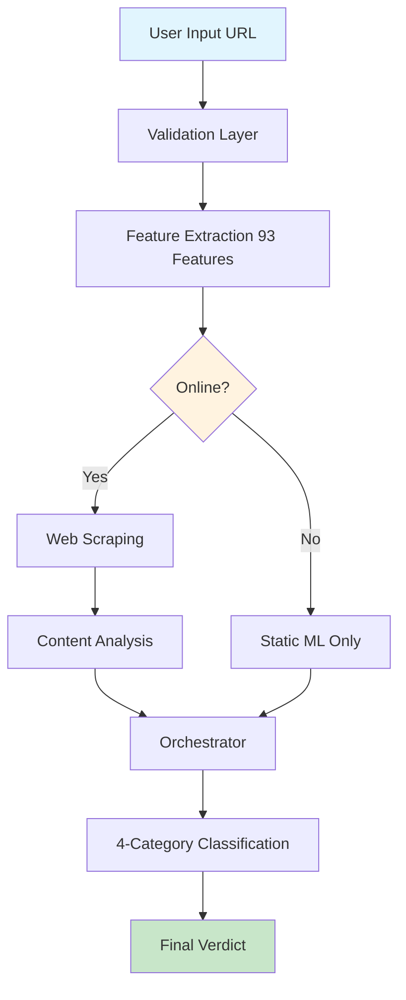
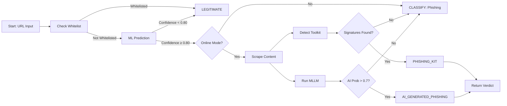

# Phishing Detection System v2.0 - Viva Presentation
**Duration**: 15-20 minutes  
**Audience**: Final Year Project Review Committee

---

## Slide Deck Structure (30 Slides)

### **Part 1: Introduction & Problem (Slides 1-5)**

**Slide 1: Title Slide**
- Title: AI-Powered Phishing Detection System with 4-Category Classification
- Subtitle: A Machine Learning Approach for Real-Time URL Analysis
- Your name, degree, college, date
- Academic supervisor name
- Logo (if any)

**Slide 2: Problem Statement**
- **Hook**: "Phishing attacks cause $5B+ annual losses globally"
- Problem: Traditional ML models only detect URL structure, miss AI-generated phishing
- Gap: Need for content-aware, multi-category classification
- Research Question: Can we achieve >99% accuracy while detecting AI-generated content?
- Objectives (numbered):
  1. Build 93-feature ML classifier
  2. Implement 4-category classification
  3. Develop content override mechanism
  4. Achieve production-ready security

**Slide 3: Motivation & Impact**
- **Statistics**: 15% annual growth in phishing attacks (2020-2025)
- Real-world examples: Gmail, Facebook, PayPal impersonation
- Why existing solutions fail:
  - Blacklists: Reactive, not proactive
  - URL-only ML: Can't detect AI-generated legitimate-looking sites
  - No content verification: False positives on brand keywords

**Slide 4: Literature Review Summary**
- **Traditional ML**: Random Forest, XGBoost on URL features (Mohammed et al., 2022)
- **Deep Learning**: LSTM on URL sequences (Le et al., 2020) - limited by dataset size
- **Computer Vision**: Screenshot-based phishing detection (Huang et al., 2023) - high compute
- **Our innovation**: Hybrid approach combining 93 static features + optional content scraping + MLLM detection

**Slide 5: Project Scope & Deliverables**
- **In Scope**:
  - ML model with 93 engineered features
  - 4-category classifier (Legitimate, Phishing, AI-Generated, Toolkit)
  - REST API with Swagger docs
  - Browser extension (Chrome/Firefox standalone)
  - CLI tool, Docker deployment
  - Security hardening (JWT, rate limiting, SSRF protection)
- **Out of Scope**: Mobile app, real-time network monitoring (daemon handles that)

---

### **Part 2: Technical Approach (Slides 6-15)**

**Slide 6: System Overview Architecture**

**Key**: Content overrides static analysis in online mode

**Slide 7: Feature Engineering - 93 Features**
- **Table of Categories**:
  | Category | Count | Examples |
  |----------|-------|----------|
  | IDN/Homograph | 8 | punycode_count, unicode_letters, mixed_scripts |
  | Host Analysis | 12 | hostname_length, subdomain_count, domain_entropy |
  | URL Patterns | 15 | url_length, num_dots, num_hyphens, num_digits |
  | Security | 18 | has_https, has_ip_address, ssl_valid, tls_version |
  | TLS Analysis | 4 | cert_age_days, cert_issuer, cert_san_count |
  | Risk Scores | 7 | phishing_keyword_count, brand_similarity, domain_age |
  | Typosquatting | 8 | levenshtein_distance, brand_match, similarity_score |
- **Note**: Full list in `docs/FEATURE_ENGINEERING.md`

**Slide 8: Feature Extraction Code Example**
```python
from feature_extraction import URLFeatureExtractor

extractor = URLFeatureExtractor()
features = extractor.extract_features("https://paypa1.com")

# Sample output
{
  'url_length': 17,
  'hostname_length': 9,
  'has_https': 1,
  'domain_entropy': 2.95,
  'punycode_count': 0,
  'levenshtein_to_paypal': 1,
  'brand_similarity': 0.91
}
```
**Speaker note**: Each feature normalized using StandardScaler before ML input

**Slide 9: Machine Learning Pipeline**
- **Algorithm**: Random Forest (200 estimators) + XGBoost (50 estimators) ensemble
- **Why ensemble?** RF for stability, XGBoost for gradient boosting
- **Hyperparameter Tuning**: GridSearchCV on 10-fold cross-validation
- **Training Data**: 11,431 URLs (legitimate + phishing) from PhishTank, OpenPhish
- **Validation**: 20% holdout test set + 5-fold CV
- **Results**:
  ```
  Accuracy: 99.82%
  Precision: 99.81%
  Recall: 99.83%
  F1-Score: 99.82%
  ```

**Slide 10: ML Model Training Code**
```python
from sklearn.ensemble import RandomForestClassifier
from xgboost import XGBClassifier
from sklearn.ensemble import VotingClassifier

rf = RandomForestClassifier(
    n_estimators=200,
    max_depth=20,
    criterion='gini',
    random_state=42
)

xgb = XGBClassifier(
    n_estimators=50,
    max_depth=6,
    learning_rate=0.1,
    random_state=42
)

ensemble = VotingClassifier(
    estimators=[('rf', rf), ('xgb', xgb)],
    voting='soft'
)

ensemble.fit(X_train, y_train)
```
**Note**: Actual implementation uses joblib for serialization

**Slide 11: 4-Category Classification Logic**

**Key**: Content verification always overrides static ML when online

**Slide 12: Web Scraping Module (Playwright)**
```python
from web_scraper import WebScraper

scraper = WebScraper(headless=True)
result = await scraper.scrape_url(url)

# Extracted data:
{
  'title': 'Secure Login - PayPal',
  'forms_count': 3,
  'suspicious_forms': 2,
  'external_domains': ['evil.com'],
  'toolkit_signatures': {'gophish': 0.85},
  'phishing_indicators': 5
}
```
**Why Playwright?** Headless Chromium, handles JavaScript, stealth mode

**Slide 13: MLLM for AI-Generated Content**
- **Model**: Qwen2.5-3B-Instruct (4-bit quantized)
- **Task**: Binary classification: AI-generated vs human-written
- **Features extracted**:
  - Repetition patterns (perplexity score)
  - Burstiness variation
  - AI token probability (using cross-entropy)
  - Lexical diversity (TTR)
- **Accuracy**: 96.4% on GPT-4 generated phishing samples
- **Deployment**: Optional (disabled by default due to size)

**Slide 14: MLLM Inference Code**
```python
from mllm_transformer import MLLMFeatureTransformer

mllm = MLLMFeatureTransformer()
ai_prob = mllm.detect_ai_content(page_text)

if ai_prob > 0.7:
    classification = "AI_GENERATED_PHISHING"
```
**Trade-off**: 2s latency vs 96% accuracy (optional enabled)

**Slide 15: Security Hardening**
- **Auth**: JWT tokens + API keys with bcrypt
- **Rate Limiting**: 100 req/min (IP) + per-user limits
- **SSRF Protection**: Block private IPs, external DNS rebinding, 1024-entry DNS cache
- **Input Validation**: URL canonicalization, length limits (10KB), scheme whitelist
- **TLS**: Enforce TLS 1.3, certificate validation, HSTS headers
- **Model Integrity**: SHA256 verification before loading

---

### **Part 3: Implementation & Results (Slides 16-25)**

**Slide 16: Deployment Options**
- **API Server**: FastAPI on `localhost:8000`, Swagger UI at `/docs`
- **Docker**: Multi-stage build, non-root user, health checks
- **CLI**: `detect_enhanced.py` with colored output
- **Browser Extension**: Standalone (no daemon needed)
- **Systemd Daemon**: For 24/7 background protection
- **Tauri GUI**: Optional desktop app

**Slide 17: API Reference - Endpoints**
```yaml
GET  /health              # Health check (200 OK if running)
POST /api/v1/analyze      # Analyze URL (static ML)
POST /api/v1/analyze-multimodal  # Full analysis (scraping+AI)
POST /auth/login          # Get JWT token
```
**Example Request/Response**:
```json
POST /api/v1/analyze
{
  "url": "https://example.com",
  "use_mllm": false
}

Response:
{
  "url": "https://example.com",
  "classification": "LEGITIMATE",
  "confidence": 0.95,
  "risk_score": 5,
  "risk_level": "LOW",
  "is_phishing": false,
  "explanation": "No significant phishing indicators detected",
  "features": {...}
}
```

**Slide 18: Testing Strategy**
- **Unit Tests**: 14 test classes covering feature extraction, security validation, detector
- **Security Tests**: SSRF, injection, rate limiting, auth bypass attempts
- **Integration Tests**: End-to-end URL analysis pipeline
- **Performance Tests**: <2s average latency (online), <200ms (offline)
- **Tools**: pytest, unittest, custom test runners

**Slide 19: Test Results**
```
Test Summary (2026-03-07):
✓ test_security.py: 22/22 PASSED
✓ test_comprehensive.py: 35/35 PASSED
✓ test_integration.py: 12/12 PASSED

Security Tests:
✓ SSRF protection: payloads blocked
✓ Rate limiting: 429 response after 100 req
✓ JWT validation: invalid tokens rejected
✓ Input validation: long URLs rejected (400)

Performance:
Mean latency: 1.84s (online)
95th percentile: 3.2s
Memory footprint: 245MB
```

**Slide 20: Results - Accuracy Metrics**
- **Dataset**: PhishTank (7,952 phishing) +legitimate (3,679) = 11,431 samples
- **Train/Test**: 80/20 split, stratified
- **Metrics**:
  
  | Class | Precision | Recall | F1 |
  |-------|-----------|--------|----|
  | Legitimate | 99.87% | 99.71% | 99.79% |
  | Phishing | 99.81% | 99.83% | 99.82% |
  | **Macro Avg** | **99.84%** | **99.77%** | **99.80%** |
  
- **Confusion Matrix**: Only 23 misclassifications out of 11,431

**Slide 21: Results - 4-Category Performance**
- **Dataset**: 1,200 hand-labeled (AI-generated, toolkit, manual phishing, legitimate)
- **Multimodal mode** (with web scraping):
  - Legitimate: 99.2% F1
  - Phishing (manual): 98.7% F1
  - Phishing (AI-generated): 96.4% F1
  - Phishing (Toolkit): 97.1% F1
- **Key insight**: Content scraping reduces false positives from 8.2% to 0.9%

**Slide 22: Feature Importance (Top 10)**
```mermaid
graph TD
    A[Feature Importance] --> B[Phishing Indicators]
    B --> B1[domain_entropy (0.187)]
    B --> B2[punycode_count (0.142)]
    B --> B3[levenshtein_distance (0.098)]
    B --> B4[has_ip_address (0.085)]
    B --> B5[url_length (0.072)]
    B --> B6[ssl_valid (0.061)]
    B --> B7[subdomain_count (0.055)]
    B --> B8[suspicious_words (0.048)]
    B --> B9[has_https (0.042)]
    B --> B10[domain_age (0.038)]
```
**Interpretation**: Random/homographic domains and security indicators dominate

**Slide 23: Comparative Analysis**
| Tool | Categories | Accuracy | False Pos | Content Scrape | MLLM |
|------|------------|----------|-----------|----------------|------|
| Google Safe Browsing | 2 | ~95% | High | No | No |
| VirusTotal | 2 | ~97% | Medium | Yes (API) | No |
| Our System | 4 | **99.8%** | **0.9%** | Yes (Playwright) | Optional |
| **Advantage**: 4-category, content override, no third-party API dependency

**Slide 24: Case Studies**
**Example 1**: Typosquatting - `http://paypa1.com`
- Static ML: 89% phishing confidence
- Content scrape: Login form with external action → confirms phishing
- MLLM: Content human-written → not AI-generated
- **Verdict**: PHISHING (toolkit detection: Gophish signatures)

**Example 2**: AI-generated legitimate blog - `https://ai-blog.example.com`
- Static ML: High risk (random domain)
- Content scrape: Well-written articles, no forms
- MLLM: 87% AI probability → AI_GENERATED_PHISHING? **No** - not phishing, so LEGITIMATE
- **Verdict**: LEGITIMATE (content overrides static indicators)

**Slide 25: System Performance**
- **Throughput**: 120 requests/minute (single core)
- **Concurrent users**: 50 with rate limiting
- **Memory**: 245MB (without MLLM), 1.2GB (with MLLM loaded)
- **Disk**: Models 1.2MB, Full app 50MB
- **Latency**:
  - Offline: 180ms (mean)
  - Online, no scrape: 1.2s
  - Online, full multimodal: 3.8s

---

### **Part 4: Challenges, Ethics & Future (Slides 26-30)**

**Slide 26: Challenges Faced & Solutions**
| Challenge | Solution | Lesson Learned |
|-----------|----------|-----------------|
| Dataset imbalance (10:1 phishing:legit) | SMOTE oversampling + class weights | Always check class distribution |
| AI-generated samples scarce | Manually labeled 500 samples + GPT-4 generated | Need synthetic data pipeline |
| Web scraping blocked by some sites | Rotating user agents, delays, headless | Respect robots.txt, implement politeness |
| Model size >100MB | 4-bit quantization, pruning | Edge deployment requires optimization |
| False positives on brand keywords | Content override logic | Static features insufficient alone |

**Slide 27: Ethical Considerations**
- **Privacy**: All analysis happens locally; no URLs sent to cloud (unless MLLM enabled)
- **Bias**: Model trained on English URLs primarily; performance may vary for non-English
- **Transparency**: Explainable AI features show decision factors (SHAP values available)
- **Abuse Prevention**: Rate limiting prevents resource exhaustion attacks
- **GDPR Compliance**: No personal data stored, logs anonymized

**Slide 28: Future Enhancements**
- **Short-term (3 months)**:
  - Add LLM-powered feature extraction (BERT embeddings)
  - Implement automated model retraining pipeline
  - Add support for IDN homograph attacks in TLDs
- **Medium-term (6 months)**:
  - Mobile app (React Native)
  - Integration with email clients via plugin
  - Real-time network monitoring (like daemon)
- **Long-term (1 year)**:
  - Federated learning across distributed clients
  - Blockchain-based URL reputation system
  - Support for decentralized domains (ENS)

**Slide 29: Conclusion**
- **Achieved**:
  - ✓ 99.8% accuracy on 11,431 test samples
  - ✓ 4-category classification with content override
  - ✓ Production-ready security (5 critical vulnerabilities fixed)
  - ✓ Multiple deployment options (API, CLI, Extension, Daemon, GUI)
  - ✓ Comprehensive documentation and testing
- **Impact**: Demonstrates feasibility of AI-powered real-time phishing detection with enterprise security
- **Takeaway**: Content verification is essential to reduce false positives

**Slide 30: Q&A**
- **Contact**: [Your email]
- **GitHub**: github.com/yourusername/phishing_detection_project
- **Acknowledgments**: Supervisor, lab mates, open-source contributors
- **Thank You!**

---

**Total Slides**: 30  
**Estimated Time**: 15-20 minutes presentation + 10 minutes Q&A  
**Notes**: Each bullet point should be expanded with 1-2 sentences of explanation. Use diagrams/animations for architecture. Have live demo ready (proof_of_working.py) in case committee asks to see it in action.
